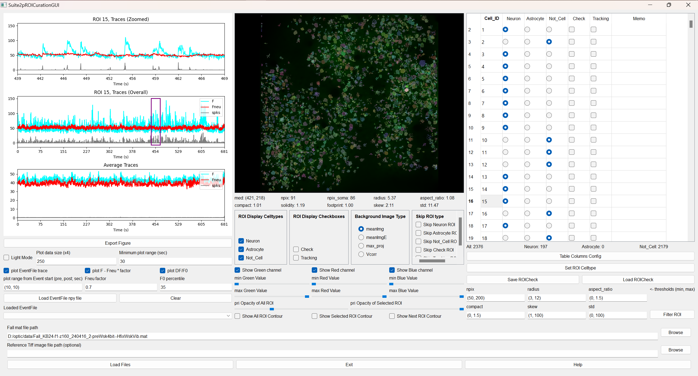
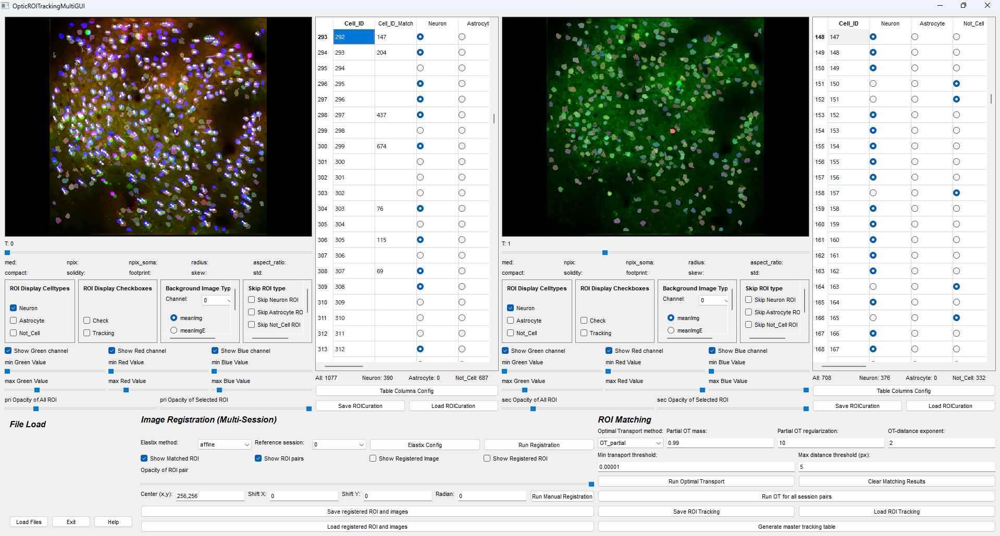
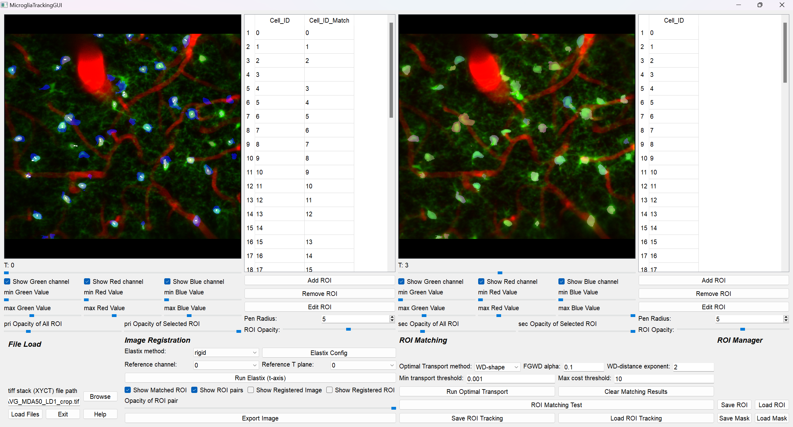
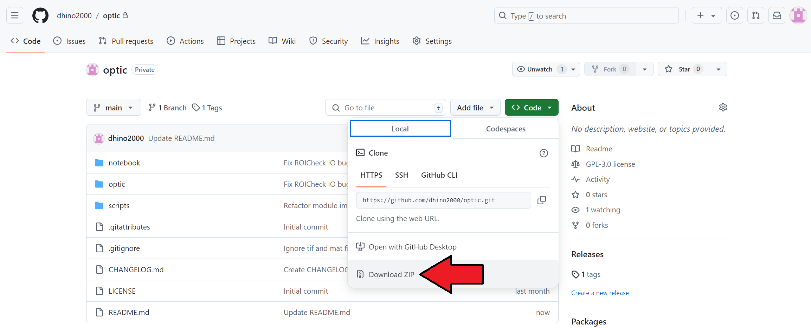

# OPTIC
## OPTIC (OPtimized Toolbox for Image-based Cellular analysis)

[**OPTIC Documentation**](https://optic.readthedocs.io/en/latest/)

OPTIC consists of three specialized applications:

### 1. OpticROICuration


#### Input Format
- Fall.mat: Suite2p output file containing ROI information
- CaImAn HDF5 (alternative): same role as Fall.mat
- Reference TIFF image (optional)
- Event npy file (optional): for stimulus timing analysis

#### Features
- Efficient ROI classification (Neurons, Noise, etc.)
- Supports multiple cell types (Astrocytes, Axonal bouton, …)
- Event-aligned trace analysis
- Real-time ROI selection with trace visualization
- Customizable table columns

### 2. OpticROITracking


#### Input Format
- Two or more Fall.mat files from different imaging sessions
- (alternative) CaImAn HDF5 files

#### Features
- Manual and automated ROI tracking between sessions
- Pairwise mode (2 sessions) **and multi-session mode (N ≥ 3)**
- Image registration (ITKElastix: Rigid / Affine / B-spline)
- Optimal Transport-based one-to-one ROI matching
- Visualization of matched ROI pairs with registration-aware white lines
- **Master Tracking Table** export — graph-theoretic consolidation of pairwise matches into a single multi-session CSV

### 3. OpticRawTracking


#### Input Format
- TIFF stack (dimensions: XYCT)
  - X, Y: spatial dimensions
  - C: channels for multichannel imaging
  - T: time points for time-lapse imaging

#### Features
- Cellpose integration for ROI detection (Microglia, Neurons, ...)
- Manual ROI drawing / editing
- **ImageJ ROI Manager** interop (`.zip` round-trip)
- Time-series ROI tracking with image registration + Optimal Transport
- **Master Tracking Table** export across all time points

## Installation

### Requirements
- OS: Windows 11
- Python: 3.10
- CPU: ≥ 24 cores
- RAM: ≥ 128 GB

### Installation

1. Install [Anaconda](https://www.anaconda.com/download/success)

- Install Anaconda distribution and prepare Python environment.

2. Install OPTIC package



- Click on the "Download ZIP" button and extract the contents of the downloaded file.
- Move the extracted folder to the appropriate directory.

(ex) `C:/Users/dhino2000/optic`

3. Environment settings

Choose one of the following methods (a or b) to set up the environment:

#### a) Create with yaml file

- Open "Anaconda Prompt" and move to the OPTIC directory:
  ```bash
  cd {optic_directory}
  ```
- Create the OPTIC environment with:
  ```bash
  conda env create -f optic.yml
  ```

#### b) Manual package installation

- Open "Anaconda Prompt" and create a new environment:
  ```bash
  conda create -n optic python=3.10
  activate optic
  ```
- Install the required packages:

| Package | Version |
|---|---|
| PyQt5 | 5.15.11 |
| numpy | 1.26.4 |
| itk-elastix | 0.23.0 |
| matplotlib | 3.10.8 |
| pot | 0.9.6 |
| scikit-image | 0.25.2 |
| cellpose[gui] | 3.1.0 |
| networkx | ≥ 3.4 |
| pandas | ≥ 2.0 |

> **Note**: If you want to use HDF5 files analyzed with CaImAn, please install CaImAn according to the [CaImAn official documentation](https://caiman.readthedocs.io/en/latest/Installation.html).  
> **Note**: If you want to use Cellpose with GPU acceleration, please set up a CUDA-compatible PyTorch environment according to the [PyTorch official documentation](https://pytorch.org/).

## How to use
### OpticROICuration

1. Open Anaconda Prompt and activate the environment:
   ```bash
   activate optic
   ```
2. Execute the `optic_roi_curation.py` script:
   ```bash
   python C:/Users/dhino2000/optic/scripts/optic_roi_curation.py
   ```
3. Sort and check ROIs!
   ([OpticROICuration Tutorial](https://optic.readthedocs.io/en/latest/OpticROICuration/tutorial.html))

### OpticROITracking

1. Open Anaconda Prompt and activate the environment:
   ```bash
   activate optic
   ```
2. Execute the `optic_roi_tracking.py` script:
   ```bash
   python C:/Users/dhino2000/optic/scripts/optic_roi_tracking.py
   ```
3. Track ROIs across sessions, and optionally export the master tracking table!
   ([OpticROITracking Tutorial](https://optic.readthedocs.io/en/latest/OpticROITracking/tutorial.html))

### OpticRawTracking

1. Open Anaconda Prompt and activate the environment:
   ```bash
   activate optic
   ```
2. Execute the `optic_raw_tracking.py` script:
   ```bash
   python C:/Users/dhino2000/optic/scripts/optic_raw_tracking.py
   ```
3. Extract, track, and export ROIs from your XYCT TIFF stack!
   ([OpticRawTracking Tutorial](https://optic.readthedocs.io/en/latest/OpticRawTracking/tutorial.html))

<!--
## Downstream Analysis
After analyzing with these applications, some downstream analyses may be required. For guidance on these analyses, please refer to the Jupyter notebooks beginning with **"Chapter"** in the [notebook folder](https://github.com/dhino2000/optic/tree/main/notebook). These notebooks provide step-by-step examples and instructions for some downstream analysis workflows.


## Citation

If you use OPTIC in your work, please cite:

> Fukatsu, N., Tanisumi, Y., Cheung, D., Saito, Y., Hashimoto, A., Takahashi, N., Takeda, I., Inoue, M., & Wake, H. *OPTIC: A Rapid and Efficient Semi-automated Toolbox for Multicellular Calcium Imaging Analysis.*

-->

## Dependencies and External Libraries

This project includes / depends on the following external libraries:

### Suite2p

- Original Repository: <https://github.com/MouseLand/suite2p>

```bibtex
@article {Pachitariu061507,
    author = {Pachitariu, Marius and Stringer, Carsen and Dipoppa, Mario and Schr{\"o}der, Sylvia and Rossi, L. Federico and Dalgleish, Henry and Carandini, Matteo and Harris, Kenneth D.},
    title = {Suite2p: beyond 10,000 neurons with standard two-photon microscopy},
    elocation-id = {061507},
    year = {2017},
    doi = {10.1101/061507},
    publisher = {Cold Spring Harbor Laboratory},
    URL = {https://www.biorxiv.org/content/early/2017/07/20/061507},
    journal = {bioRxiv}
}
```

### CaImAn

- Original Repository: <https://github.com/flatironinstitute/CaImAn>

```bibtex
@article{giovannucci2019caiman,
  title   = {CaImAn an open source tool for scalable calcium imaging data analysis},
  author  = {Giovannucci, Andrea and Friedrich, Johannes and Gunn, Pat and Kalfon, J{\'e}r{\'e}mie and Brown, Brandon L and Koay, Sue Ann and Taxidis, Jiannis and Najafi, Farzaneh and Gauthier, Jeffrey L and Zhou, Pengcheng and Khakh, Baljit S and Tank, David W and Chklovskii, Dmitri B and Pnevmatikakis, Eftychios A},
  journal = {eLife},
  volume  = {8},
  pages   = {e38173},
  year    = {2019},
  doi     = {10.7554/eLife.38173},
  url     = {https://elifesciences.org/articles/38173}
}
```

### Cellpose

- Original Repository: <https://github.com/MouseLand/cellpose>

```bibtex
@article {Stringer2024.02.10.579780,
    author = {Stringer, Carsen and Pachitariu, Marius},
    title = {Cellpose3: one-click image restoration for improved cellular segmentation},
    elocation-id = {2024.02.10.579780},
    year = {2024},
    doi = {10.1101/2024.02.10.579780},
    publisher = {Cold Spring Harbor Laboratory},
    URL = {https://www.biorxiv.org/content/early/2024/02/25/2024.02.10.579780},
    journal = {bioRxiv}
}
```

### ITKElastix

- Original Repository: <https://github.com/InsightSoftwareConsortium/ITKElastix>

### POT (Python Optimal Transport)

- Original Repository: <https://github.com/PythonOT/POT>

```bibtex
@article{flamary2021pot,
  author  = {R{\'e}mi Flamary and Nicolas Courty and Alexandre Gramfort and Mokhtar Z. Alaya and Aur{\'e}lie Boisbunon and Stanislas Chambon and Laetitia Chapel and Adrien Corenflos and Kilian Fatras and Nemo Fournier and L{\'e}o Gautheron and Nathalie T.H. Gayraud and Hicham Janati and Alain Rakotomamonjy and Ievgen Redko and Antoine Rolet and Antony Schutz and Vivien Seguy and Danica J. Sutherland and Romain Tavenard and Alexander Tong and Titouan Vayer},
  title   = {POT: Python Optimal Transport},
  journal = {Journal of Machine Learning Research},
  year    = {2021},
  volume  = {22},
  number  = {78},
  pages   = {1-8},
  url     = {http://jmlr.org/papers/v22/20-451.html}
}
```

### NetworkX

- Original Repository: <https://github.com/networkx/networkx>


## References
[1] Marius Pachitariu, Carsen Stringer, Mario Dipoppa, Sylvia Schröder, L. Federico Rossi, Henry Dalgleish, Matteo Carandini, Kenneth D. Harris. "Suite2p: beyond 10,000 neurons with standard two-photon microscopy", bioRxiv, 2016.

[2] Giovannucci, A., Friedrich, J., Gunn, P., Kalfon, J., Brown, B.L., Koay, S.A., Taxidis, J., Najafi, F., Gauthier, J.L., Zhou, P. (2019). CaImAn an open source tool for scalable calcium imaging data analysis. eLife 8, e38173.

[3] Stringer, C., Wang, T., Michaelos, M., & Pachitariu, M. (2021). Cellpose: a generalist algorithm for cellular segmentation. Nature methods, 18(1), 100-106.

[4] Pachitariu, M. & Stringer, C. (2022). Cellpose 2.0: how to train your own model. Nature methods, 1-8.

[5] Stringer, C. & Pachitariu, M. (2024). Cellpose3: one-click image restoration for improved segmentation. bioRxiv.

[6] S. Klein, M. Staring, K. Murphy, M.A. Viergever, J.P.W. Pluim, "elastix: a toolbox for intensity based medical image registration", IEEE Transactions on Medical Imaging, vol. 29, no. 1, pp. 196 - 205, January 2010.

[7] D.P. Shamonin, E.E. Bron, B.P.F. Lelieveldt, M. Smits, S. Klein and M. Staring, "Fast Parallel Image Registration on CPU and GPU for Diagnostic Classification of Alzheimer's Disease", Frontiers in Neuroinformatics, vol. 7, no. 50, pp. 1-15, January 2014.

[8] Kasper Marstal, Floris Berendsen, Marius Staring and Stefan Klein, "SimpleElastix: A user-friendly, multi-lingual library for medical image registration", International Workshop on Biomedical Image Registration (WBIR), Las Vegas, Nevada, USA, 2016.

[9] K. Ntatsis, N. Dekker, V. Valk, T. Birdsong, D. Zukić, S. Klein, M. Staring, M. McCormick, "itk-elastix: Medical image registration in Python", Proceedings of the 22nd Python in Science Conference, pp. 101 - 105, 2023.

[10] Rémi Flamary, Nicolas Courty et al., POT Python Optimal Transport library, Journal of Machine Learning Research, 22(78):1−8, 2021.

[11] Hagberg, A.A., Schult, D.A., & Swart, P.J. (2008). Exploring network structure, dynamics, and function using NetworkX. Proceedings of the 7th Python in Science Conference (SciPy2008), pp. 11–15.
