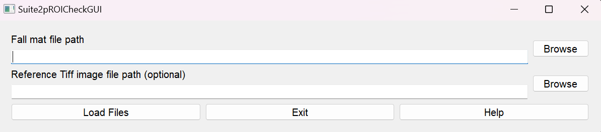
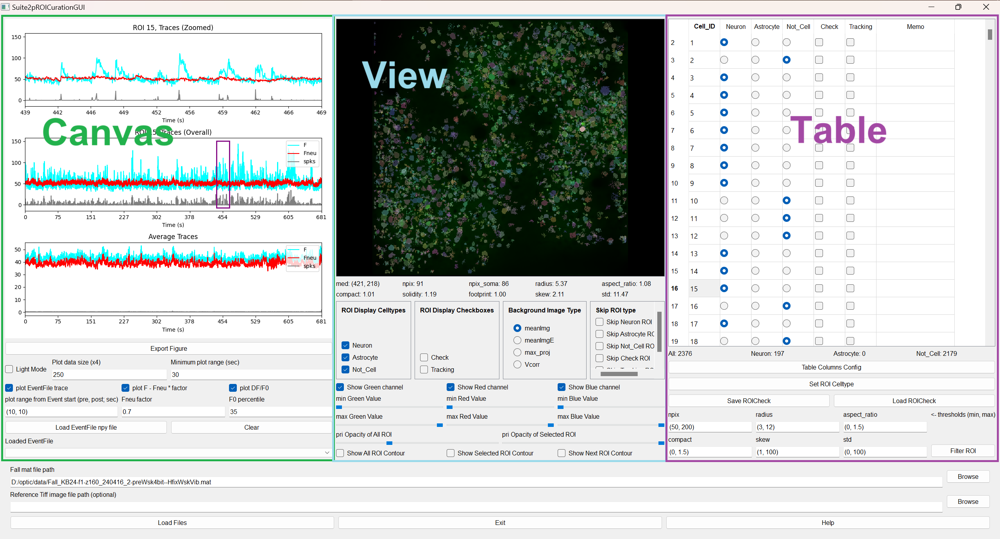
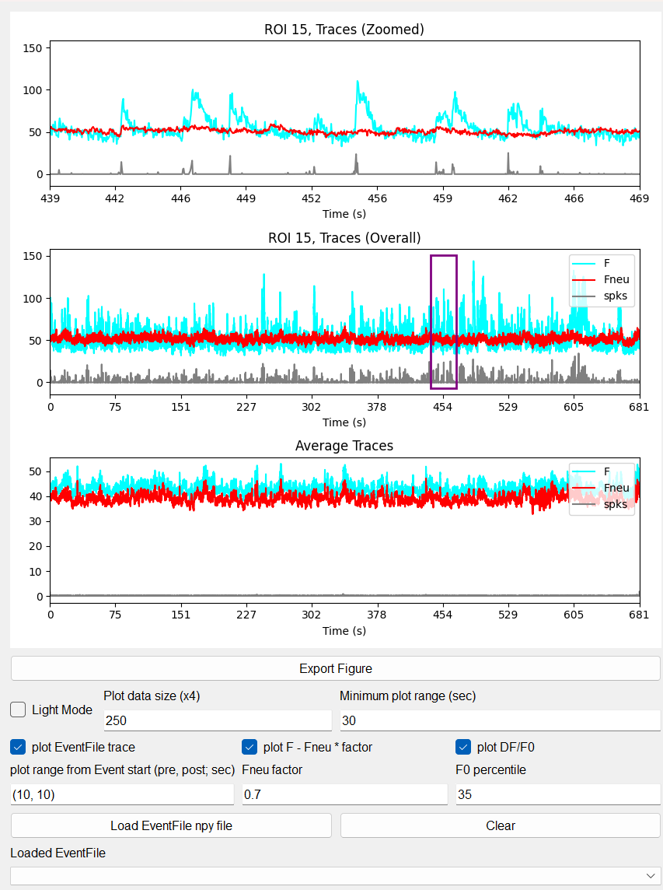
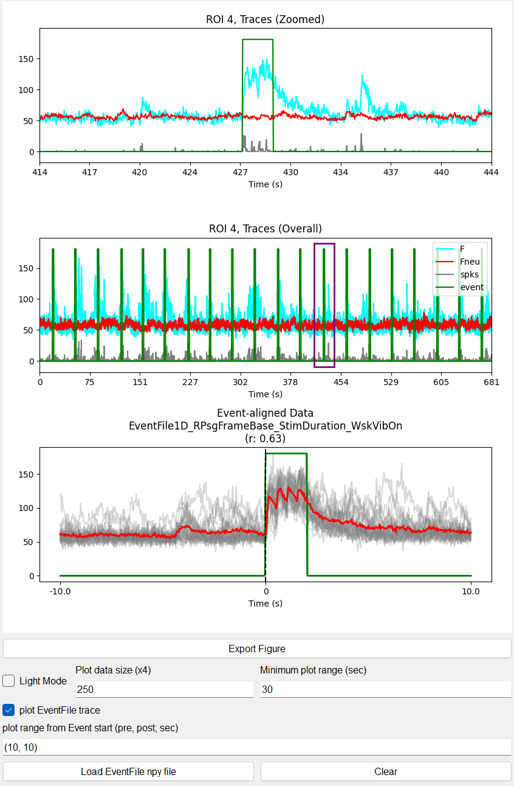
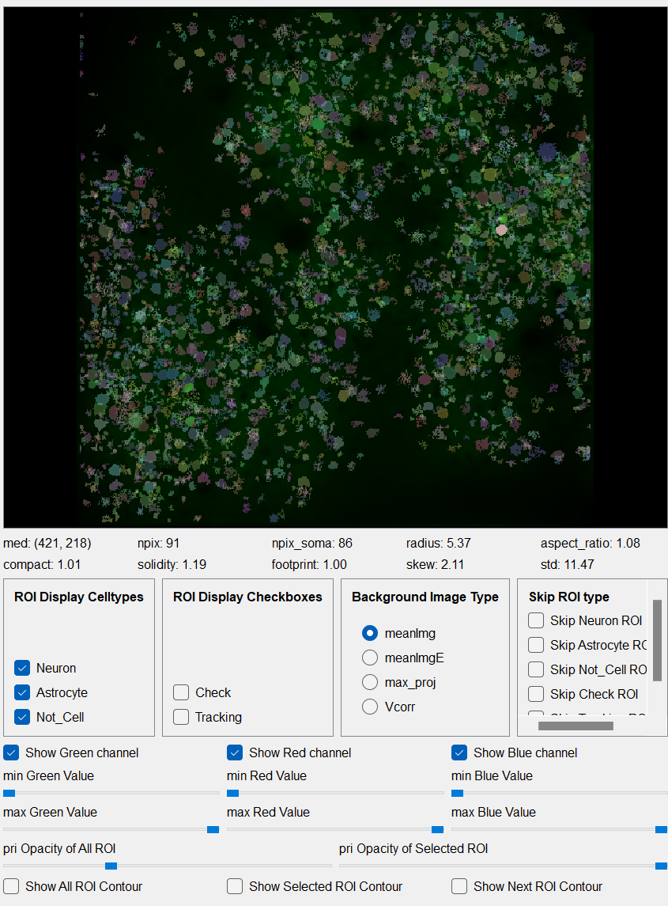
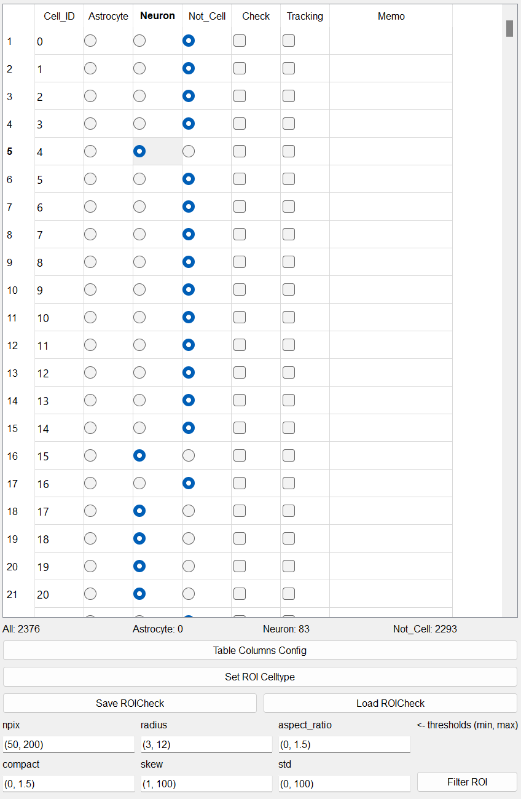
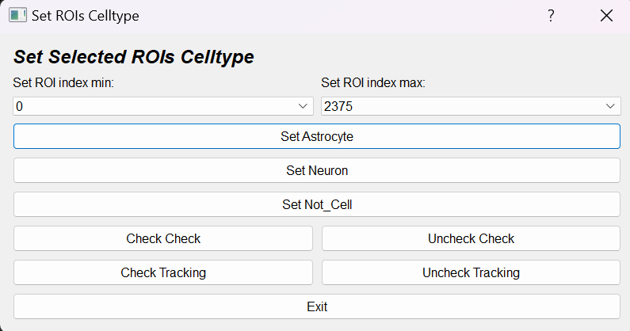
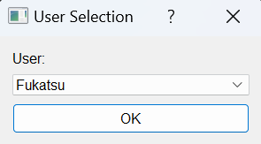
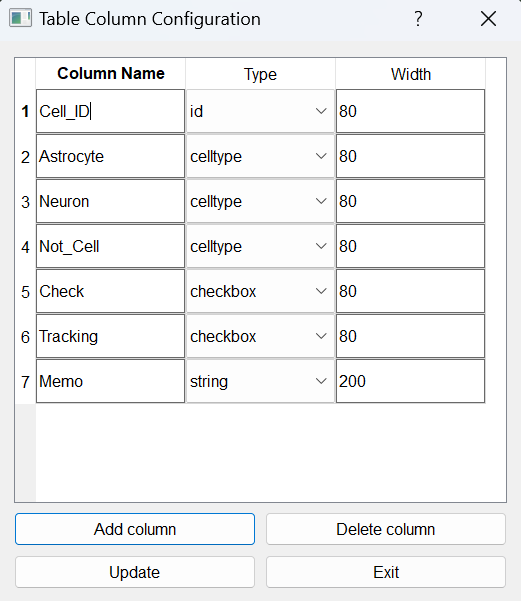
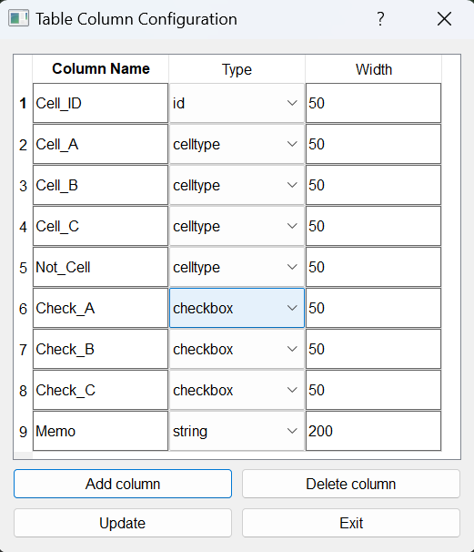

# OpticROICuration

**OpticROICuration** is a GUI for rapidly classifying ROIs extracted by Suite2p or CaImAn into user-defined categories (e.g. neuron / astrocyte / not-cell / noise). It is also useful for inspecting event-aligned activity and tagging ROIs with custom metadata before downstream analysis.

## Workflow

1. **Load** the Suite2p `Fall.mat` (or CaImAn `*.hdf5`) — optionally also a reference TIFF and a behaviour event `.npy` file.
2. **Configure table columns** if you want celltypes other than the defaults — see [Table Columns Config](#table-columns-config).
3. **Curate ROIs** through the [Canvas](#canvas-section), [View](#view-section), and [Table](#table-section) panels.
4. **Save** the result as `ROICuration_*.mat`.

## Input

| File | Required? | Notes |
|---|---|---|
| `Fall.mat` (Suite2p) | ✔ | 2-channel supported; multi-plane not supported |
| `*.hdf5` (CaImAn) | ✔ (alternative) | Same role as `Fall.mat` |
| Reference TIFF (single XY frame) | optional | Displayed on the blue channel for cell-type identification |
| Behaviour event `.npy` (1D boolean) | optional | Used to align traces to stimulus / event onsets |

## Output

`ROICuration_{name_of_Fall}.mat` — contains every saved curation snapshot (each saved date is recorded as a separate sub-key). The file is the standard input to [OpticROITracking](../OpticROITracking/tutorial.md) and the analysis notebooks in `notebook/`.

## File load

- **Fall.mat / CaImAn hdf5 path** — click **browse** and pick the file.
- **Reference TIFF path** *(optional)* — click **browse** and pick a single XY TIFF. Useful for overlaying structural channels (e.g. tdTomato in a blue channel) to identify cell types morphologically.

## Application interface

OpticROICuration is split into three panels: **Canvas** (left, traces), **View** (middle, image + ROIs), and **Table** (right, metadata).

---

### Canvas section

<table>
<tr><td width="50%">

The Canvas shows Ca²⁺ activity (F / Fneu / spks) of the currently selected ROI on three stacked axes.

- **Top axis** — zoomable inspection window
  - Mouse drag: pan along the time axis
  - Mouse scroll: zoom in/out
  - **Minimum Plot Range**: lower bound for the displayed window (in seconds)
- **Middle axis** — full-session trace
  - Click anywhere to re-centre the top axis on that point
- **Bottom axis** — average trace across all ROIs
  - When an event file is loaded, this axis is replaced by an **event-aligned trace** of the selected ROI

**Event file**

- **Event file**: 1D NumPy boolean array (e.g. `[0, 0, 1, 1, 1, 0, ...]`) matched to the Ca²⁺ frame length
- **Plot Range**: window (s) drawn around each event onset; overlapping events are overlaid
- **r**: Pearson correlation between the trace and the event vector

**Light Mode**

Reduces CPU load by downsampling plotted points. With value 250, ~1000 points are drawn (4× the value).

</td><td width="50%">

**Canvas with event file loaded** (1 = whisker stimulation ON, 0 = OFF):

</td></tr></table>

---

### View section

<table>
<tr><td width="50%">

The View displays ROI footprints overlaid on a Suite2p / CaImAn background. The selected ROI is highlighted.

- **Mouse left click**: select the closest ROI (after applying skip filters)
- **Ctrl + wheel**: zoom in/out
- **Middle drag**: pan
- **R**: reset zoom

**ROI properties** (Suite2p-derived; see [Suite2p docs](https://suite2p.readthedocs.io/en/latest/outputs.html))

| Field | Meaning |
|---|---|
| `med` | (y, x) centre of ROI |
| `npix` / `npix_soma` | Number of pixels in ROI / in soma |
| `radius` | Estimated radius from a 2D Gaussian fit |
| `aspect_ratio` | Ratio of major/minor axes of the fit |
| `compact` | Compactness (1 = disk, >1 = less compact) |
| `solidity` | Compactness-like measure |
| `footprint` | Spatial extent of functional signal |
| `skew` | Skewness of the neuropil-corrected fluorescence |
| `std` | Standard deviation of the neuropil-corrected fluorescence |

**ROI Display Setting** — show all ROIs, none, or only specific cell types.

**Background image** — switch between Suite2p outputs (`meanImg`, `meanImgE`, `max_proj`, `Vcorr`).

**Skip ROIs** — when curating, skip ROIs already assigned a given celltype. For example, after you have finished classifying all Neurons, enable *Skip Neuron* to focus on the remaining classes.

**Image contrast**

| Channel | Source |
|---|---|
| Green | Primary imaging channel (`meanImg` / `meanImgE` / `max_proj` / `Vcorr`) |
| Red | Secondary imaging channel (only meaningful for dual-channel Fall.mat) |
| Blue | Reference TIFF (only if loaded) |

**ROI opacity** — sliders for the global ROI layer and the selected ROI's highlight.

</td><td width="50%">

</td></tr></table>

---

### Table section

<table>
<tr><td width="50%">

The Table holds per-ROI metadata. Each column has one of four types:

| Type | Behaviour |
|---|---|
| `id` | ROI index (Cell_ID). Read-only. |
| `celltype` | One-of-N selection via radio buttons (e.g. Neuron / Astrocyte / Not_Cell). |
| `checkbox` | Boolean toggle, e.g. Check / Tracking. |
| `string` | Free-text memo. |

**Table Columns Config** — see [Table Columns Config](#table-columns-config) below. Re-arrange, rename, add, or remove columns.

**Set ROI celltype (bulk)** — change the celltype / checkbox of many ROIs at once between two row indices, optionally constrained by other column states.
> Example: `index_min=100, index_max=300, Set=Neuron, Skip Check=Checked` →
> only ROIs in rows 100–300 whose **Check** is *unchecked* are reclassified as Neuron.

**Filter ROI** — automatically demote ROIs to **Not_Cell** when any of `npix / radius / aspect_ratio / compact / skew / std` falls outside the configured (min, max) range.

**Save / Load ROICuration**

- Saved as `ROICuration_*.mat`.
- The username chosen at save time is recorded; configure usernames in `optic/config/json/user_settings.json`.
- The save file keeps a **history of every save** (keyed by timestamp), so you can resume from any past snapshot.
- For downstream analysis using the saved file, see the [analysis notebooks](https://github.com/dhino2000/optic/tree/main/notebook/analysis).

</td><td width="50%">

**Bulk celltype dialog**

**Save dialog** (user picker)

</td></tr></table>

#### Keyboard shortcuts

For the default columns `[Cell_ID, Neuron, Astrocyte, Not_Cell, Check, Tracking, Memo]`:

| Key | Action |
|---|---|
| `Z` | Mark as **Astrocyte** |
| `X` | Mark as **Neuron** |
| `C` | Mark as **Not_Cell** |
| `V` | Toggle **Check** |
| `B` | Toggle **Tracking** |
| `Y` / `H` | Previous / next ROI matching the celltype selected in *ROI Display Setting* |
| `U` / `J` | Previous / next ROI of the same celltype as the currently selected one |
| `I` / `K` | Previous / next ROI whose **Check** is checked |
| `O` / `L` | Previous / next ROI whose **Check** is unchecked |
| `↑` / `↓` | Move one row |

Shortcuts adapt automatically if you customise the columns.

---

## Table Columns Config

The default column set is `[Cell_ID, Neuron, Astrocyte, Not_Cell, Check, Tracking, Memo]`. You can customise it via the **Table Columns Config** button.

<table>
<tr><td width="50%">

**Column Name**

Free text, with constraints:

> ⚠️ **Do not include spaces** — use `_` instead (`cell A` ✗ / `cell_A` ✓).
> The last `celltype` column should be named **`Not_Cell`**. Drop-down classification logic depends on this convention.

**Type**

| Type | Description |
|---|---|
| `id` | ROI index (starts at 0, read-only) |
| `celltype` | Radio-button group; exactly one selected per ROI |
| `checkbox` | Boolean toggle |
| `string` | Free text (English / numbers only) |

**Width**

Initial column width (px). Can also be dragged in the table header.

**Auto-naming** — when you click *Add column*, the new column is automatically named `new_cell_type_1`, `new_cell_type_2`, … (the smallest free number), so duplicates never occur.

</td><td width="50%">

**Default**

**Customised**

</td></tr></table>

After saving the configuration, the table — together with all side-panel widgets (Display Cells, Skip ROI, …) — is fully rebuilt to reflect the new columns.

<!-- TODO: replace with a screenshot of the main app showing customised columns

-->

### Keyboard shortcuts (customised example)

For `[Cell_ID, Cell_A, Cell_B, Cell_C, Not_Cell, Check_A, Check_B, Check_C, Memo]`:

| Key | Action |
|---|---|
| `Z` / `X` / `C` | Mark as Cell_A / Cell_B / Cell_C |
| `V` | Mark as Not_Cell |
| `B` / `N` / `M` | Toggle Check_A / Check_B / Check_C |
| `↑` / `↓` | Move one row |
