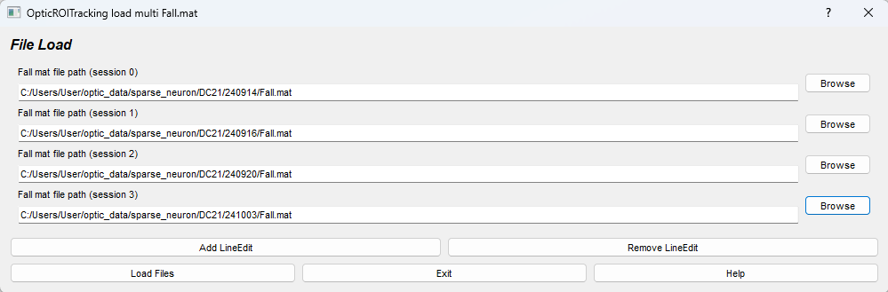
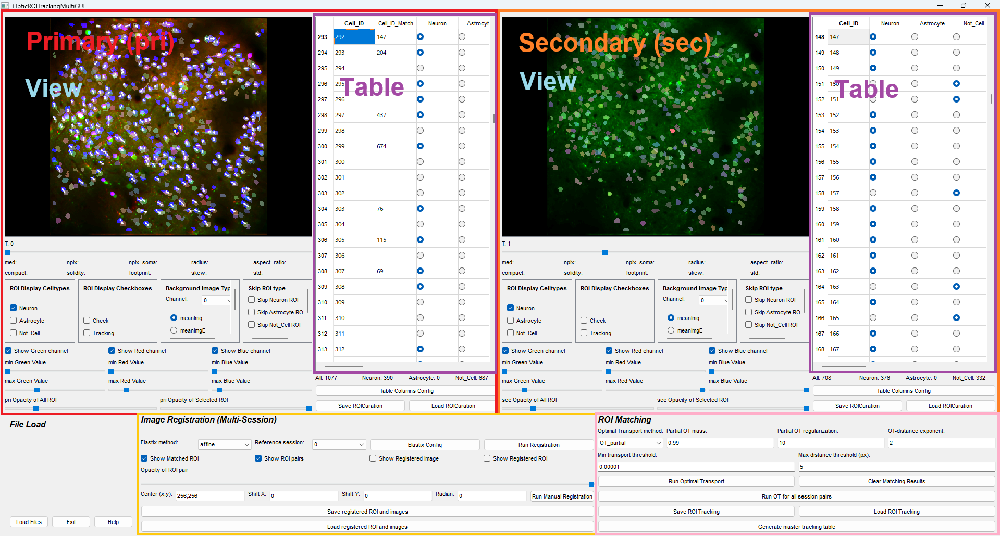
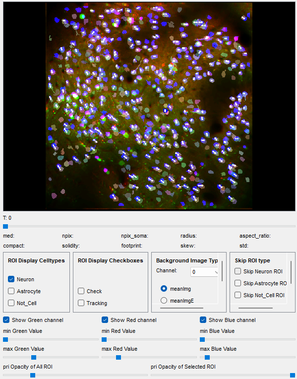
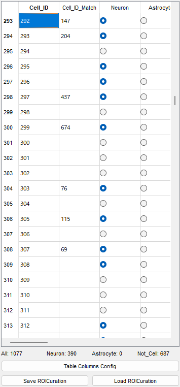
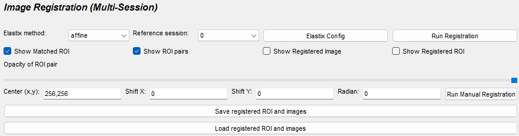
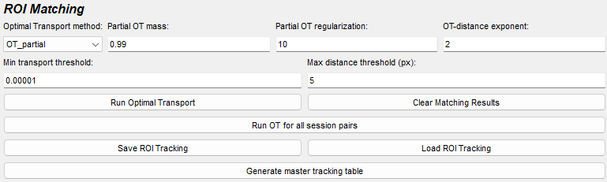
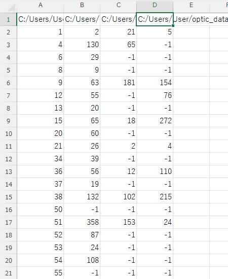

# OpticROITracking


**OpticROITracking** tracks corresponding ROIs across two or more imaging sessions of the same subject. The pipeline is:

1. **Image registration** (ITKElastix) to correct session-to-session drift and distortion.
2. **Optimal-Transport (OT) matching** to identify one-to-one ROI correspondences between registered sessions.
3. **Graph-theoretic alignment** (NetworkX) to consolidate every pairwise match into a single multi-session **Master Tracking Table** CSV.

OpticROITracking consumes the output of OpticROICuration, so the typical workflow is to **curate first** with [OpticROICuration](../OpticROICuration/tutorial.md) and then track.

## Workflow

1. **Load** N Fall.mat files (N ≥ 2) via the File Load dialog — see [File load](#file-load).
2. *(optional)* **Load** the matching `ROICuration_*.mat` files via *Load ROICuration* to inherit celltype tags.
3. [**Image Registration**](#image-registration) — align every session to a reference session (or align a specific pair only, or correct manually).
4. [**ROI Matching**](#automatic-roi-matching) — run automatic OT matching across every session pair, then manually fix any wrong matches in the `Cell_ID_Match` column.
5. [**Generate Master Tracking Table**](#master-tracking-table) — export the consolidated multi-session CSV.

## Input

| File | Required? | Notes |
|---|---|---|
| `Fall.mat` (Suite2p) | ✔ | Two or more sessions of the same subject |
| `*.hdf5` (CaImAn) | ✔ (alternative) | Same role as `Fall.mat` |
| `ROICuration_*.mat` | optional | Carries celltype tags from OpticROICuration |

## Output

| File | Content |
|---|---|
| `ROItracking_{name_of_primary_Fall}.mat` | Per session-pair tracking result |
| `master_tracking_{name_of_first_Fall}.csv` | Multi-session consolidated table (one row per ROI identity, one column per session) |

## File load



The File Load dialog accepts an arbitrary number of `Fall.mat` files. Use the buttons to manage the list:

- **Add LineEdit** — appends an empty path field. Type or paste the full path to a `Fall.mat`, or use the per-row *browse* button.
- **Remove LineEdit** — removes the last (unnecessary) path field.
- **Load Files** — loads all `Fall.mat` files in the list at once and builds the main UI.

> ⚠️ **Important**
> - **No blank fields** — every LineEdit must contain a valid `Fall.mat` path before pressing *Load Files*. Empty rows will cause the load to fail.
> - **Mind the session order** — sessions are stored in the order they appear in the list, and the order determines `t_pri`/`t_sec` (the **primary session must always be younger than the secondary**). Put the earliest imaging session at the top.

After loading, the slider's range becomes `[0, N-1]`, where each value indexes one of the loaded Fall.mat files.

## Application interface



The window has two upper panels (**pri** on the left, **sec** on the right), each with a **View** and a **Table** section. The pri panel mirrors OpticROICuration with the addition of a `Cell_ID_Match` column. The bottom panel holds the **Image Registration** and **ROI Matching** controls.

Each panel has its own **T slider** above the View — see [Pri View section](#pri-view-section) for slider semantics.

---

### Pri View section

<table>
<tr><td width="50%">

The pri View shows the pri session's ROIs and, when registration has been run, the registered sec ROIs / image as an overlay. A white line connects each matched (pri, sec) pair, with both endpoints anchored to the **registered** ROI centres so the line stays aligned with what is drawn.

**T slider**

Moving the slider above the View **changes the session index** displayed in that panel. The slider's range matches the number of Fall.mat files loaded.

> Like OpticRawTracking, **the primary session is always younger than the secondary**. The two sliders are linked: if you push pri past sec, sec is automatically bumped forward (and vice versa) so that `t_pri < t_sec` always holds.

**Mouse**

- **Left click**: select the closest pri ROI (after skip filters)
- **Right click**: select the closest sec ROI shown in the overlay
- **Middle drag**: pan
- **Ctrl + wheel**: zoom in/out
- **R**: reset zoom

> Zoom and pan are preserved across other operations (table refresh, slider moves). Press **R** to restore auto-fit.

The remaining controls (ROI properties / Display Setting / Background image / Skip ROI / contrast / opacity) match the [OpticROICuration View section](../OpticROICuration/tutorial.md#view-section).

**Channel meanings here**

| Channel | Content |
|---|---|
| Green | pri background |
| Red | sec background, *overlaid* onto pri view |
| Blue | sec ROI image, *overlaid* onto pri view |

</td><td width="50%">



</td></tr></table>

---

### Pri Table section

<table>
<tr><td width="50%">

The pri table is identical to the OpticROICuration table plus one extra column:

- **Cell_ID_Match** — the sec ROI ID matched to this pri ROI. Empty if there is no match. Edit by clicking the cell; the value must be an integer within the valid sec ROI range.

  When you fill in a Cell_ID_Match, a white line is drawn on the View connecting the two ROIs.

  > **Tip:** you usually only need to fill in matches for the cell types of interest (e.g. only neurons). Leave the rest blank.

**One-to-one matching** — avoid pri-to-many or many-to-sec ambiguities. The automatic OT step enforces one-to-one by construction; only manual edits can break it.

> ⚠️ **Column compatibility with ROICuration files**
> Before loading a `ROICuration_*.mat`, make sure the pri/sec tables use the *same celltype/checkbox columns* as the curation file (minus `Cell_ID_Match`, which is pri-only).
> Use **Table Columns Config** — pri and sec are kept in sync automatically (sec inherits everything except `Cell_ID_Match`).

</td><td width="50%">



</td></tr></table>

#### Persistent edits across session switches

Moving the T sliders rebuilds the pri / sec tables. The following state is preserved automatically:

- **Celltype / checkbox / memo edits** — captured per session before you leave, restored when you come back.
- **`Cell_ID_Match` edits** — synced to `dict_roi_matching` before any rebuild.
- **Display Cells filter** — the side-panel "show only Neuron" toggle survives session switches.

This means you can navigate freely between sessions, edit matches in one pair, and have everything in place when you return.

---

### Image Registration

<table>
<tr><td width="50%">

OpticROITracking uses [ITKElastix](https://github.com/InsightSoftwareConsortium/ITKElastix) to align sessions. Three transformation models are available, from rigid (fastest, minimal deformation) to B-spline (slowest, handles local distortion).

| | Rigid | Affine | B-spline |
|---|---|---|---|
| Computation speed | 0.5 – 1 s/image | 1 – 2 s/image | 2 – 4 s/image |
| Degrees of freedom | Moderate | Good | Excellent |
| Shape preservation | Excellent | Good | Moderate |
| Robustness | Good | Good | Good |
| Local deformation handling | Poor | Poor | Excellent |
| Motion correction | Poor | Moderate | Excellent |
| Registration accuracy | Moderate | Good | Excellent |

**B-spline notes** — the OPTIC default tunes the `Metric1Weight` parameter to 100.0, which trades off accuracy against shape distortion of individual ROIs. Because B-spline can deform ROIs nonlinearly, OpticROITracking uses the transformed ROI centres only for cross-session matching and keeps the original ROI parameters (npix, skew, …) untouched in downstream files.

**Registration modes**

OpticROITracking supports three complementary registration modes:

- **All sessions against one reference** — pick a *reference session*; every loaded session is warped onto that session's coordinate frame. Recommended as the default; required for the [Master Tracking Table](#master-tracking-table).
- **Single session pair** — register only the currently displayed `(t_pri, t_sec)` pair. Useful for testing parameters before running on all sessions.
- **Manual registration** — bypass Elastix and apply a user-specified affine transform. Useful when the automatic registration fails (typically due to high inter-session drift or low contrast).

  | Parameter | Meaning |
  |---|---|
  | **Center (x, y)** | Rotation centre (in pixel coordinates) |
  | **Shift X, Y** | Translation in pixels |
  | **Radian** | Rotation angle in radians (360° = 2π) |

  Tweak the values, click **Run Manual Registration**, and the sec image / ROIs are transformed accordingly. Iterate until the overlay looks correct.

**Run (automatic)**

1. Pick **Elastix method** (`None` / rigid / affine / B-spline).
2. Pick **reference channel** (channel 0 by default; pick channel 1 for dual-channel imaging when channel 1 is more stable).
3. Pick **reference session** in the *All sessions* mode.
4. Optionally open **Elastix Config** for fine-grained tuning (max iterations, sampling density, penalty weights, …).
5. Click **Run Elastix** and watch progress in the Anaconda Prompt.

**Save / Load registration result**

Registration results (transformed ROIs + background images) can be **saved** to a `.mat` file and **reloaded** later. This lets you re-open a session set and skip the Elastix run — useful because B-spline can take a few minutes per session.

</td><td width="50%">



**Elastix config window**


</td></tr></table>

---

### Automatic ROI matching

<table>
<tr><td width="50%">

Automatic matching uses [Optimal Transport](https://github.com/PythonOT/POT) on the ROI centroids. The algorithm finds the assignment that minimises total transport cost (Euclidean distance) between pri and sec centroid sets, then prunes the result to one-to-one matches.

**Parameters**

| Parameter | Meaning |
|---|---|
| **OT method** | `OT_partial` (recommended) / `OT` / `OT_partial_entropic` / `OT_partial_lagrange`. Partial variants allow some ROIs to remain unmatched. |
| **Partial OT mass `m`** | Fraction of total mass to transport (0–1). OPTIC's default is **0.99** — 1 % of ROIs are treated as outliers and left unmatched. |
| **OT distance exponent `p`** | Minkowski distance exponent (default 2 = Euclidean). |
| **Min transport threshold** | Drop transport entries below this weight (default 1e-5). |
| **Max distance threshold (px)** | Pri/sec centroid pairs farther apart than this are treated as biologically implausible and assigned a prohibitive cost. Tune to your imaging resolution (default 10 px). |

**Pruning** — after OT, two clean-up steps enforce one-to-one matching:

1. **Reference selection** — whichever side has fewer ROIs is used as the reference; each reference ROI matches at most one ROI on the other side.
2. **Conflict resolution** — when multiple candidates exist for the same reference ROI, keep the lowest-cost (closest) pair only.

**Run modes**

- **Run OT** — match only the currently displayed `(t_pri, t_sec)` pair.
- **Run OT for all session pairs** — iterate over every `(t_pri, t_sec)` combination. Required before [Generate Master Tracking Table](#master-tracking-table).

The matched ROIs are written to the pri table's `Cell_ID_Match` column and stored internally for graph-based alignment.

**Save / Load tracking**

- `ROItracking_*.mat` — per session-pair data; useful as a backup or for sharing intermediate results.
- For the consolidated multi-session export, use the [Master Tracking Table](#master-tracking-table) below.

</td><td width="50%">



</td></tr></table>

---

## Master Tracking Table

The **Master Tracking Table** consolidates pairwise OT matches from every session into a single CSV where each row is one ROI identity and each column is one session. Click **Generate master tracking table** in the ROI Matching panel after running OT for all session pairs.

### Algorithm — graph-based alignment

The pairwise OT step produces N(N − 1)/2 match dictionaries. To merge them into consistent multi-session identities, OpticROITracking constructs an undirected graph (NetworkX):

- **Node**: `(session_label, roi_id)` — one per ROI in every session
- **Edge**: drawn between two nodes if those ROIs were matched in any pairwise OT result

Connected components are then classified:

| Subgraph shape | Meaning | Kept? |
|---|---|---|
| Single isolated node | ROI seen only in one session | ✔ (one-session entry) |
| Complete graph (every node connected to every other) | ROI identity is consistent across all involved sessions | ✔ |
| Incomplete graph | Conflicting pairwise matches (identity-switch or false positive) | ✗ Dropped |

Only complete subgraphs are emitted to the CSV, guaranteeing that **every reported ROI identity is supported by *every* pairwise comparison**.

### Output CSV



- **Filename**: `master_tracking_{first_fall_basename}.csv` by default (you can change it in the save dialog).
- **Columns**: one per session — labelled with the **full path of each `Fall.mat`** so multi-session datasets stay unambiguous.
- **Rows**: one per ROI identity.
- **Cells**: the ROI ID in that session, or `-1` if the ROI is absent in that session.

> **Cell-type filter**
> Only ROIs whose celltype is currently turned **ON** in the side-panel *ROI Display Celltypes* are exported. For example, with only *Neuron* enabled, the CSV will contain only Neuron-classified ROIs across all sessions. To export multiple celltypes, enable them in *ROI Display Celltypes* before clicking *Generate master tracking table*.

After saving, the console prints:

```
[master_tracking_table] complete subgraphs: 84, incomplete subgraphs: 3, ratio_complete: 0.9655
[master_tracking_table] incomplete subgraphs (excluded from CSV):
  [('/path/sess_A.mat', 12), ('/path/sess_B.mat', 21), ('/path/sess_C.mat', 30)]
```

Use the listed incomplete subgraphs as a checklist for manual repair: jump to the corresponding session pair, fix the bad match in `Cell_ID_Match`, and re-export.
