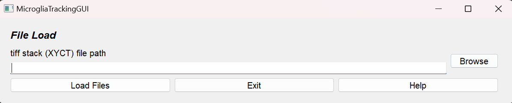
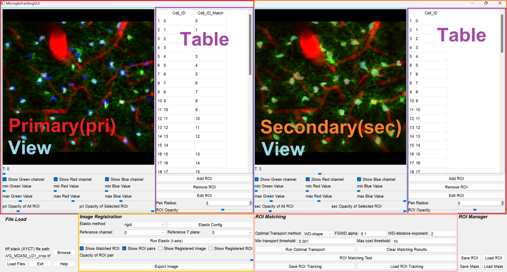
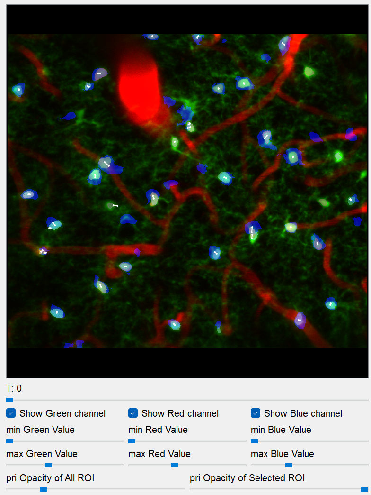
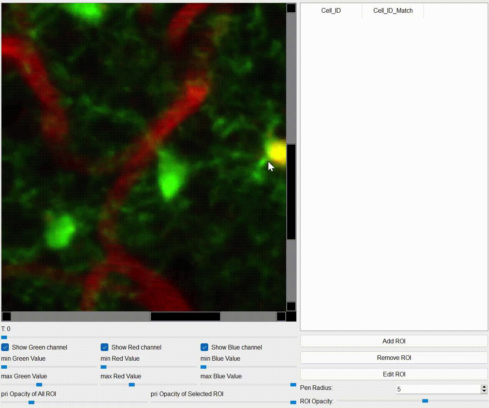
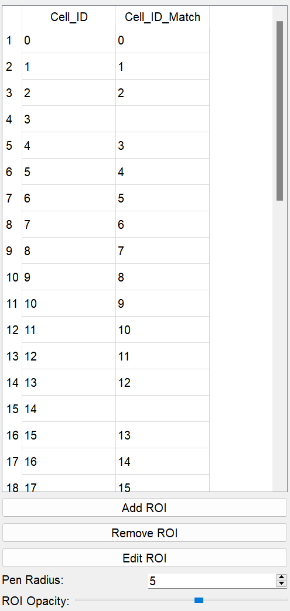
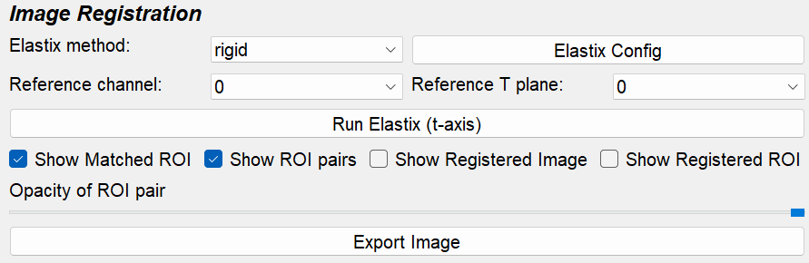
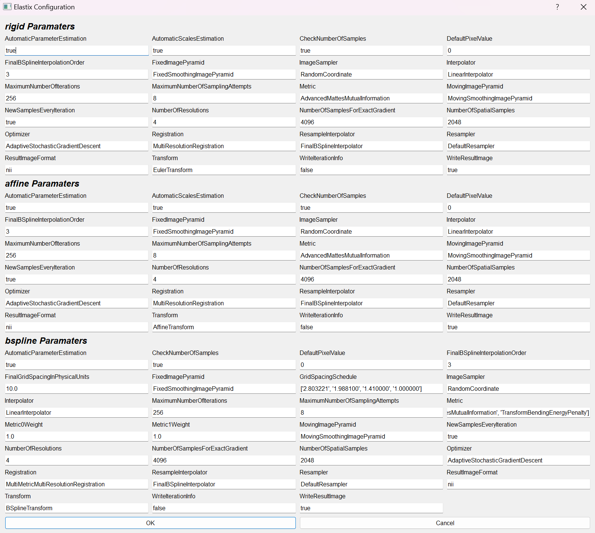
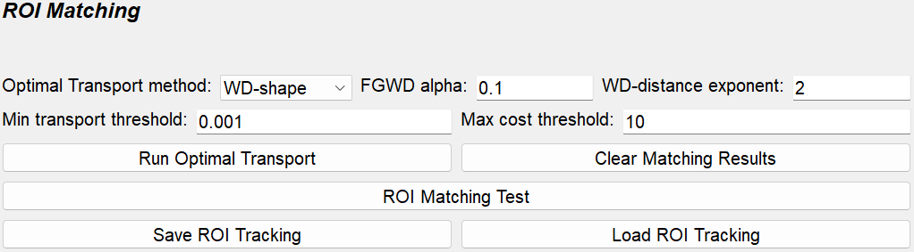

# OpticRawTracking


**OpticRawTracking** is a generalised ROI tracker that works directly on raw XYCT TIFF stacks — no Suite2p / CaImAn pre-processing required. It bundles:

- **Cellpose**-based ROI extraction (with optional manual draw / edit)
- **ITKElastix** image registration across time points
- **Optimal-Transport** ROI matching (same engine as OpticROITracking)
- **Graph-theoretic Master Tracking Table** export across all time points
- **ImageJ** ROI Manager interop

The name "Raw" reflects that the input is the raw image stack, not a pre-segmented ROI set. The original use case (and default workflow) is microglial dynamics in dual-channel (microglia + vessel) imaging, but the pipeline works for any XYCT data.

## Workflow

1. **Load** an XYCT TIFF stack (≥ 2 time points).
2. [**Extract ROIs**](#roi-extraction-and-editing) — either run [Cellpose](#cellpose) per time point, draw / edit manually, or import a ROI zip from ImageJ.
3. [**Image registration**](#image-registration) — align every time point to a reference T.
4. [**Automatic ROI matching**](#automatic-roi-matching) — OT match between time-point pairs.
5. **Manual touch-ups** in the `Cell_ID_Match` column.
6. **Save** `OpticRawTracking_*.mat`, and/or [**generate the Master Tracking Table**](#master-tracking-table) CSV.

## Input

| File | Required? | Notes |
|---|---|---|
| XYCT TIFF stack | ✔ | At least 2 time points; ≤ 3 channels. If you have XYZCT data, do a Z-projection first. |
| Cellpose `*_seg.npy` | optional | Skip the in-GUI Cellpose run by importing pre-computed masks |
| ImageJ ROI zip | optional | Use ROIs drawn in ImageJ as the starting point |

## Output

| File | Content |
|---|---|
| `OpticRawTracking_{tiff_name}.mat` | Per-T ROI coordinates, per-pair matching, registration result |
| `master_tracking_{tiff_name}.csv` | Consolidated multi-T tracking table (see [Master Tracking Table](#master-tracking-table)) |
| `*.zip` (ImageJ ROIs) | Optional export to ImageJ ROI Manager |

## File load



Click **browse** and pick the XYCT TIFF. The slider on each panel becomes a **T (time-point) slider** after loading.

## Application interface



The window has two upper panels (**pri** / **sec**) — each showing the same TIFF at a different time point — and a bottom control panel for registration, ROI matching, and Cellpose. T sliders constrain `t_pri < t_sec`, so the two panels always compare an earlier and a later frame.

---

### View section

<table>
<tr><td width="50%">

The View displays the TIFF channel(s) at the current T plus any ROIs from the table. A white line connects each matched (pri, sec) ROI pair.

**Mouse**

- **Left click**: select the closest ROI
- **Right click** (pri view): select the closest ROI in the sec view
- **Middle drag**: pan
- **Ctrl + wheel**: zoom in/out
- **R**: reset zoom

**T slider** — change the displayed time point. `t_pri < t_sec` is enforced by the linkage.

**Channels**

| Channel | Typical content (microglia example) |
|---|---|
| Green | Primary structural / functional channel (e.g. microglia GFP) |
| Red | Secondary channel (e.g. blood vessels with Texas Red dextran) |
| Blue | Sec-side ROI image, overlaid into the pri view |

**ROI opacity** — sliders for the all-ROI layer and the selected ROI's highlight.

</td><td width="50%">



</td></tr></table>

#### ROI extraction and editing

OpticRawTracking provides three ways to populate the per-T ROI table:

1. **Cellpose** — automatic segmentation (see [Cellpose](#cellpose) below).
2. **Manual draw / edit** — see the *ROI edit mode* controls below.
3. **Import ImageJ ROI zip** — use the **ROI Manager** section's *Load ROI* button.

**ROI edit mode**

- **Add ROI** — left-drag to paint the new ROI in the view; press **Space** to commit it as a new ROI row.
- **Remove ROI** — deletes the currently selected ROI. The corresponding Cell_ID_Match entries on other T planes are cleared too.
- **Edit ROI** — modify the selected ROI's footprint.
  - Left-drag: paint
  - Right-drag: erase
  - Space: exit edit mode
- **Pen Radius** — pen size for paint / erase.
- **ROI Opacity** — opacity of the ROI under editing.



---

### Table section

<table>
<tr><td width="50%">

The table is initially empty. Rows are added by:

- Drawing ROIs in *Add ROI* mode, or
- Running Cellpose, or
- Loading a Cellpose `*_seg.npy` or ImageJ ROI zip

ROI data is stored **per T plane** — the table updates whenever you move the T slider.

**Cell_ID_Match** (pri table only)

The sec ROI ID matched to this pri ROI. Same semantics as in [OpticROITracking](../OpticROITracking/tutorial.md):

- Empty when no match exists
- Filling in a number draws a white line on the View connecting the two ROIs
- Must be an integer within the sec table's ROI ID range
- Removing an ROI also clears its Cell_ID_Match entry across all pairs

**One-to-one matching** is recommended.

</td><td width="50%">



</td></tr></table>

#### Persistence across T navigation

Moving the T slider rebuilds the tables. The following state is preserved:

- Manual `Cell_ID_Match` edits — synced before any rebuild
- Display Cells filter — re-applied after rebuild
- View zoom / pan — preserved per Ctrl+wheel zoom (press **R** to re-fit)

---

### Cellpose

<table>
<tr><td width="50%">

Automatic ROI extraction with [Cellpose](https://github.com/MouseLand/cellpose). Recommended workflow:

1. Pick the **T plane** to segment (you can repeat for each T, or batch later).
2. Pick the **channel** containing the cells of interest (e.g. green for microglia).
3. Pick a **Cellpose model** (`cyto3`, `nuclei`, `livecell`, …) and an optional **restore** model (Cellpose 3 denoising / deblur).
4. Set the **diameter** (in pixels) — leave at 0 to auto-estimate.
5. Click **Run Cellpose**. The result is written into the per-T ROI table.

**Save / Load mask** — store / restore the Cellpose `seg.npy` for the current T. This is the same format Cellpose itself uses, so segmentations can round-trip between OpticRawTracking and the standalone Cellpose GUI.

> 💡 **GPU acceleration** — install a CUDA-compatible PyTorch build (see the README) and Cellpose will use your GPU automatically.

</td><td width="50%">

<!-- placeholder for cellpose screenshot -->

</td></tr></table>

---

### Image Registration

<table>
<tr><td width="50%">

OpticRawTracking aligns every time point to a single reference time using [ITKElastix](https://github.com/InsightSoftwareConsortium/ITKElastix), and applies the resulting transform to both the image and the per-T ROIs.

| | Rigid | Affine | B-spline |
|---|---|---|---|
| Computation speed | 0.5 – 1 s/image | 1 – 2 s/image | 2 – 4 s/image |
| Degrees of freedom | Moderate | Good | Excellent |
| Shape preservation | Excellent | Good | Moderate |
| Robustness | Good | Good | Good |
| Local deformation handling | Poor | Poor | Excellent |
| Motion correction | Poor | Moderate | Excellent |
| Registration accuracy | Moderate | Good | Excellent |

**Reference channel** — pick the channel that contains the most **stable, low-motility** structures.

> For microglia + vessel imaging, **vessels are more stable** than the highly motile microglia, so the **red (vessel) channel** is usually the better registration reference. OpticRawTracking will then apply the resulting transform to the microglia channel.
> In situations where only the microglia channel is available, microglia-channel registration also works (validated in the OPTIC paper, Fig 6).

**Run**

1. Pick **Elastix method** (rigid / affine / B-spline).
2. Pick **reference channel** and **reference T plane**.
3. Optionally open **Elastix Config** for fine-grained tuning.
4. Click **Run Elastix**.
5. *(Optional)* **Export registered TIFF** — writes the warped stack to disk for downstream analysis outside OpticRawTracking.

</td><td width="50%">



**Elastix config window**



</td></tr></table>

---

### Automatic ROI matching

<table>
<tr><td width="50%">

Identical engine to [OpticROITracking](../OpticROITracking/tutorial.md#automatic-roi-matching). Operates on per-T ROI centroids:

| Parameter | Meaning |
|---|---|
| **OT method** | `OT_partial` (recommended) / `OT` / `OT_partial_entropic` / `OT_partial_lagrange` |
| **Partial OT mass `m`** | Fraction of mass transported (default 0.99; 1 % outlier budget) |
| **OT distance exponent `p`** | Minkowski exponent (default 2 = Euclidean) |
| **Min transport threshold** | Drop transport entries below this weight |
| **Max distance threshold (px)** | Pairs farther than this are treated as biologically implausible. For microglia at 0.32 µm/pixel, OPTIC's default is **20 px**; for 0.64 µm/pixel use 40 px. |

**Run modes**

- **Run Optimal Transport** — match the currently displayed `(t_pri, t_sec)` pair only.
- **Run Optimal Transport for all t-planes** — iterate over every `(t_pri, t_sec)` combination.

After OT, the pri table's `Cell_ID_Match` column is filled in, white lines are drawn on the View, and the result is persisted internally for the [Master Tracking Table](#master-tracking-table).

**Save / Load tracking** — `OpticRawTracking_*.mat` for single-pair / per-pair data.

</td><td width="50%">



</td></tr></table>

---

## Master Tracking Table

After running OT for all t-planes, click **Generate master tracking table** to export a single CSV consolidating ROI identities across every time point.

### How it works

The algorithm is identical to [OpticROITracking](../OpticROITracking/tutorial.md#master-tracking-table):

1. Build an undirected graph with `(time_point, roi_id)` nodes and edges from pairwise OT matches.
2. Classify connected components: only **complete subgraphs** (every node connected to every other) survive.
3. Emit one row per consistent ROI identity, one column per time point.

### Output CSV

- Default filename: `master_tracking_{tiff_basename}.csv`
- Column labels: `{tiff_path}:T{t}` — TIFF path with the T index appended, e.g. `…/microglia_stack.tif:T0`
- Cells: per-T ROI ID, or `-1` if the ROI is absent at that T

After saving, the console reports the count of complete vs incomplete subgraphs and lists the incomplete ones so you can fix them manually:

```
[master_tracking_table] complete subgraphs: 137, incomplete subgraphs: 5, ratio_complete: 0.9648
[master_tracking_table] incomplete subgraphs (excluded from CSV):
  [('/.../stack.tif:T0', 11), ('/.../stack.tif:T2', 4)]
  ...
```

---

## ROI Manager (ImageJ interop)

OpticRawTracking can read and write ImageJ ROI Manager `*.zip` files using the [roifile](https://pypi.org/project/roifile/) library. The naming convention is

```
M{3-digit cell ID}_S{2-digit session number}
```

For example `M042_S03` is the same cell as `M042_S04`, observed at session 3 vs session 4. This convention makes ROIs round-trip cleanly between OpticRawTracking and ImageJ for visual inspection, while preserving longitudinal correspondences.

**Save / Load**

- **Save ROI** — exports the current ROIs (across all T) as `*.zip`.
- **Save ROI (registered)** — exports the registered ROI coordinates (post Elastix transform).
- **Load ROI** — imports ROIs from a `*.zip`. Existing T-plane entries are merged according to the `M`/`S` naming convention.

> Duplicate `M`/`S` combinations are disallowed to keep cell identities unambiguous.
