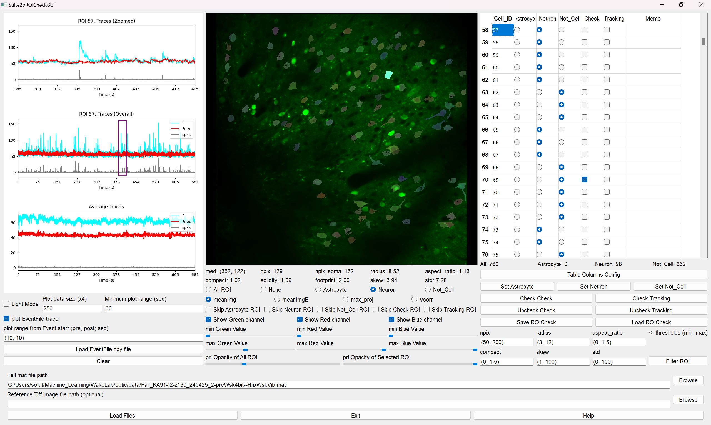
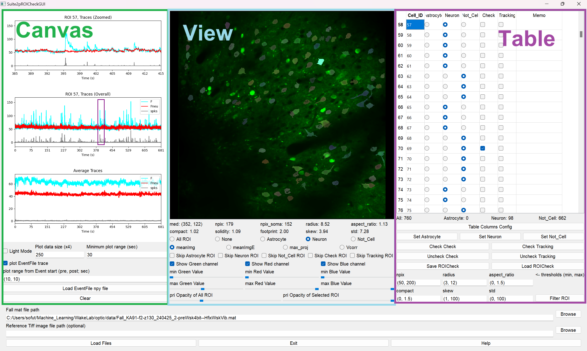
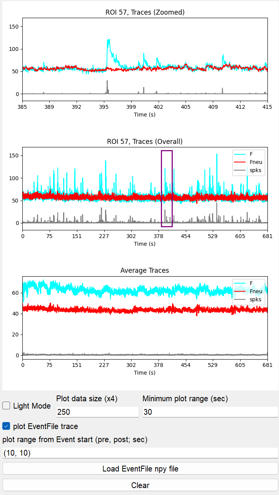
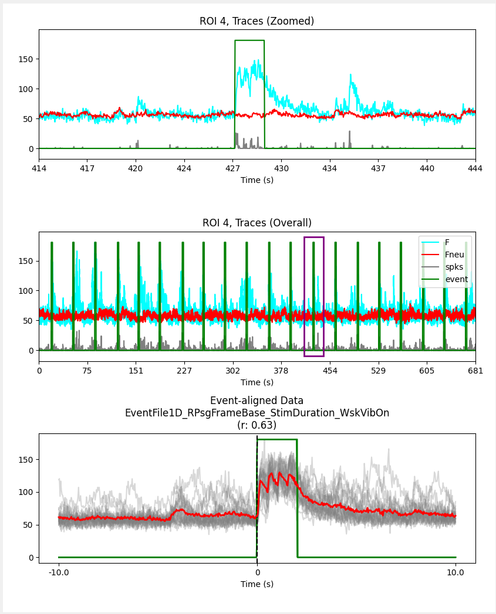
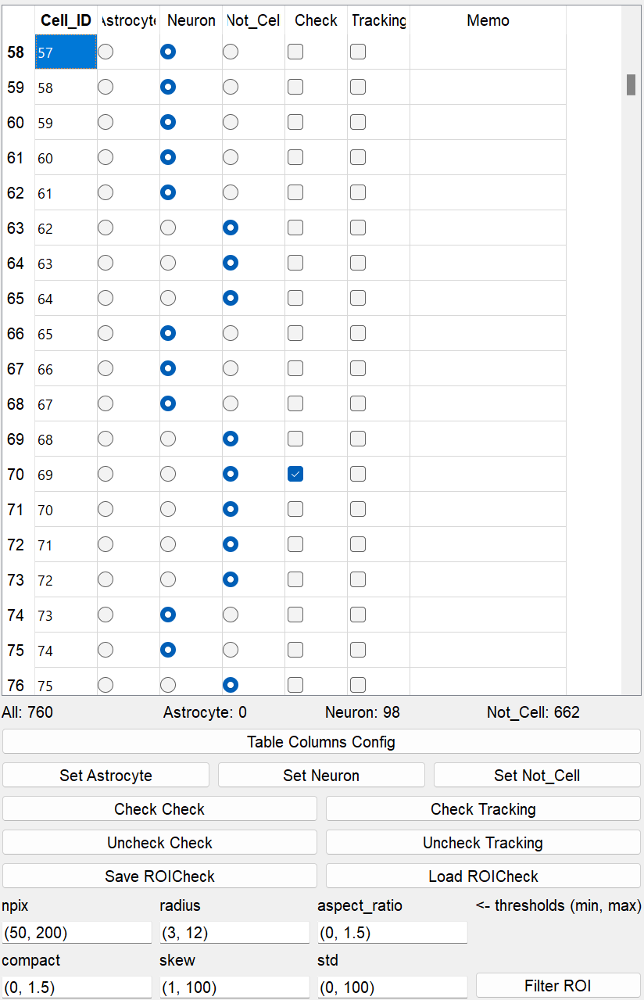

# Suite2pROICheck Tutorial

**Suite2pROICheck** is a specialized tool for quickly and efficiently classifying ROIs extracted by Suite2p into neurons and noise cells. The interface is designed to be intuitive and visually clear. It can be customized to classify cells beyond neurons, allowing users to define their own cell types. By loading event files (.npy) from behavioral experiments simultaneously done with imaging, users can identify event-responsive cells.

## Input
Before using this application, please prepare **Fall.mat**, the result file of Suite2p.  
- (Required): **Fall.mat**
- (Optional): **single tif image**  

## Output
The result of ROI checking is exported as **ROICheck~.mat**, containing the ROI celltype information and can store multiple results. About downstream analysis, please check the [notebook for analysis](https://github.com/dhino2000/optic/blob/main/notebook/Chapter1_ExtractTracesWithCheckedROIs.ipynb).
- **ROICheck_{name_of_the_Fall_file}.mat**

## Load Fall.mat file

**Fall mat file path (Required):**   
push "browse" button and choose "Fall.mat" file.  
Suite2pROICheck supports 2-channel imaging Fall.mat but not support multi-plane imaging data.  

**Reference tif image file path (Optional):**   
push "browse" button and choose single XY tif image file.  
If you capture reference image as tif file, you can use it with blue-channel image.

## Check ROIs

Suite2pROICheck consists of 3 GUI sections, **Canvas**, **View**, and **Table**.

### Canvas Section
<table>
<tr>
<td width="40%">

- **Top Axis**  
  display zoomed traces (F, Fneu, spks) of the selected ROI.
  - **mouse drag** : move display area
  - **mouse scrool** : zoom in/out
  - **Minimum Plot Range** : set minimum display time in seconds

- **Middle Axis**  
  display overall traces (F, Fneu, spks) of the selected ROI.  
  - **mouse click** : centers top axis view on clicked position
   
- **Bottom Axis**  
  display average traces (F, Fneu, spks) across all ROIs.  
  When event file is loaded, display event-aligned F trace of the selected ROI.  

- **Event File**
  - **Event File** : The npy file containing containing experimental events. The content must consist of only 0 and 1 in a format like [0, 0, 1, 1, 1, 0, 0, ...].
  - **Plot Range** : Sets display range (seconds) before/after each event onset. With multiple events, all events are overlaid.

- **Light Mode**  
  Reduces CPU load by downsampling plot points. When set to 250, plots 1,000 points (4x the value).

</td>
<td width="30%">

</td>
<td width="30%">

</td>
</tr>
</table>

### View Section
<table>
<tr>
<td width="50%">

- **View**  
  display ROIs of Fall.mat, and the choosed ROI is highlighted.
  - **mouse click** : Choose the closest ROI after passing several conditions

- **ROI property**  
  These explanations are derived from the [Suite2p documentation](https://suite2p.readthedocs.io/en/latest/outputs.html).
  - **med** : (y,x) center of cell
  - **npix** : number of pixels in ROI
  - **npix_soma** : number of pixels in ROI's soma
  - **radius** : estimated radius of cell from 2D Gaussian fit to mask
  - **aspect_ratio** : ratio between major and minor axes of a 2D Gaussian fit to mask
  - **compact** : how compact the ROI is (1 is a disk, >1 means less compact)
  - **solidity** : unknown, maybe an parameter similar to compact?
  - **footprint** : spatial extent of an ROI’s functional signal, including pixels not assigned to the ROI; a threshold of 1/5 of the max is used as a threshold, and the average distance of these pixels from the center is defined as the footprint
  - **skew** : skewness of neuropil-corrected fluorescence trace
  - **std** : standard deviation of neuropil-corrected fluorescence trace
 
- **ROI Display Setting**  
  display all ROIs, none at all or only specific celltype ROIs.
  
- **Background Image Display Setting**  
  Suite2p generate four type background images, **meanImg**, **meanImgE**, **max_proj**, and **Vcorr**. you can switch between those images.

- **Skip ROIs with choosing**  
  When choosing ROIs, for example, if all **Neuron** ROIs have already been sorted and you want to concentrate on sorting only **Astrocyte** and **Not_Cell**, you can skip ROIs that are sorted to be **Neuron**. Similarly, it is possible to set skipping for other cell types.

- **Image Contrast**  
  - **Green** : Background image (**meanImg**, **meanImgE**, **max_proj**, and **Vcorr**) contrast of primary imaging channel.
  - **Red** : Background image (**meanImg**) contrast of seconday imaging channel. If the Fall.mat dosen't have secondary channel imaging data, this is meaningless. 
  - **Blue** : Background image contrast of reference tif image. If reference tif image is not set, this is meaningless. 

- **ROI Opacity**  
  Opacity of all and the selected ROI can be changed with the sliders.

</td>
<td width="50%">

</td>
</tr>
</table>

### Table Section
<table>
<tr>
<td width="50%">

- **Table**

- **Table Columns Config**

- **ROI celltype set**

- **Filter ROI**

</td>
<td width="50%">

</td>
</tr>
</table>

#### Key operation
☆ This operation is for table columns ["Cell_ID", "Astrocyte", "Neuron", "Not_Cell", "Check", "Tracking", "Memo"]. The Operation depends on the table columns settings.
<pre>
 - Z          : Choose Astrocyte        
 - X          : Choose Neuron           
 - C          : Choose Not_Cell         
 - V          : Check/Uncheck Check     
 - B          : Check/Uncheck Tracking  
 - Y/H        : Move to previous/next ROI with the celltype selected in the "ROI Display Setting"  
 - U/J        : Move to previous/next ROI with the same celltype as the currently selected ROI  
 - I/K        : Move to previous/next ROI whose "Check" is checked  
 - O/L        : Move to previous/next ROI whose "Check" is unchecked  
 - up-arrow   : Move one row up         
 - down-arrow : Move one row down       
</pre>

## Custom Table Columns Configuration
The default columns configuration of Suite2pROICheck is ["Cell_ID", "Astrocyte", "Neuron", "Not_Cell", "Check", "Tracking", "Memo"], but you can custom them with **Table Columns Config** of Table section.

### Table Columns Config
<table>
<tr>
<td width="50%">

**Column Name**  
The name of table column, you can edit it freely, but with some restrictions.  
> ⚠️ **WARNING:**  
> **Please do not contain "space" !!! Please use "_" instead !!!**  
> NG: "cell A" , OK: "cell_A"  
> **please set the last "celltype" column as "Not_Cell" !!!**  
> NG: [Astrocyte, Not_Cell, Neuron] , OK: [Neuron, Astrocyte, Not_Cell]  

**Type**  
id:  
celltype:  
checkbox:  
string:

**Width**

</td>
<td width="50%">

</td>
</tr>
</table>

<table>
<tr>
<td width="50%">

Your text content goes here. You can use regular markdown syntax inside the td tags.
- List item 1 
- List item 2

</td>
<td width="50%">

</td>
</tr>
</table>

<pre>
 - Z          : Choose Cell_A        
 - X          : Choose Cell_B           
 - C          : Choose Cell_C         
 - V          : Choose Not_Cell     
 - B          : Check/Uncheck Check_A  
 - N          : Check/Uncheck Check_B  
 - M          : Check/Uncheck Check_C  
 - up-arrow   : Move one row up         
 - down-arrow : Move one row down       
</pre>
